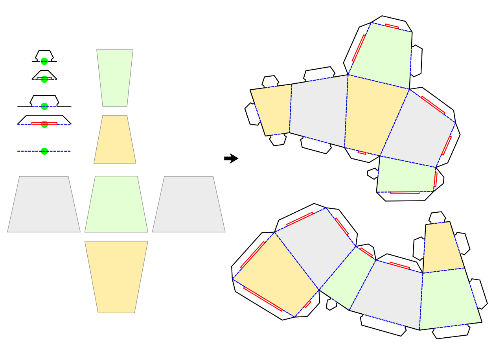

# Inkscape extension: Parallel Translation

Allows parallel translations and alignment operations of selected
straight lines. 
These lines can be simple path objects (with only start- and end-node)
or line segments of larger path objects. 
 
This extension was been written and tested using Inkscape V1.0.2  
Most probably, it will not work on versions prior to V1.0  

## Purpose

This extension has been written to help making a strange kind of paper
cube with angles different to 90 degrees. It helps to align the faces
together (probably in different arrangements, as indicated in the right
side of the screenshot below) and to add complex folding flaps with
lines in different colors to the edges. There are options to resize the
length of the flaps so that they match the length of the edges. 

## Installation

Download and unpack a zip-archive from 
https://github.com/chris0371/parallel-translation_extension
The extension is installed by copying two files into your extensions
folder (check Edit -> Settings -> System to find its location):

* `parallel-translation_extension.py`
* `parallel-translation_extension.inx`

All other files are not needed, but harmless if installed too.

Then restart inkscape and look for Extensions -> Modify Path -> Parallel Translation

## More detailed description

The functionality of the extension is spread across different tabs
of the UI. The currently selected tab determines what functionality is
performed by the extension. At first glance, the individual tabs seem
to have completely different functionality, but if you look closer, it
all comes back to the same basic concept. 

You have to tell the extension what object(s) of your drawing to 
use/modify by selecting them before hitting the apply-button. 

### Object types to select

Within all the objects selected by you, the extension always looks for
a ***line segment***, calculates its orientation angle and length, and
performs some tasks based on that calculation. This line segment could
be
1. a simple path object with just the start- and end-node. In such a 
   case, you just have to select the whole path object. Or it could be
2. a line between two nodes of a larger path object. In that case, you
   have to select the two nodes of the path. 
   
For the "Group-Alignment" functionality, the extension also looks for
an ***alignment group***. This is a group of an arbitrary number of 
other objects, which is aligned to the line segment we've talked about
earlier. 'Aligned' means that the group is rotated, moved, and it's 
width is modified to match the position, orientation and length
of the line segment. 

The extension assumes two things about an alignment group:
1. The group shall be in its horizontal default orientation. That means
that if this group is to be aligned to a horizontal line segment drawn
from left to right, it does not need to be rotated. 
2. The group shall contain exactly one special object which center marks
the rotation center of the whole group. It is recommended to use a
circle or square or simple path for this. The extension identifies this
special object by its fill-color. The color to look for can be set in
the UI (at the "Group-Alignment"-tab) and defaults to neon green 
(\#0x00FF00)

### Information Tab

This first tab contains version information and a brief explanation of
extensions functionality. Hitting the 'Apply'-button in here will just
show some basic information about the drawing, what objects are selected,
and some basic calculations done on those objects (like length and 
orientation angle for the selected line segment(s). 

### Translation Tab

This tab performs parallel translation of the selected line segment. 
That is, the extension calculates the orientation angle of the selected
line segment, and moves the object by the given distance in the direction 
of a right angle to the lines direction. 

There are options to apply the movement to just the original object, to
the original object and leaving a copy at the original position, or 
to a copy of the object leaving the original one untouched. 

There are also options to revert the movement direction and to use 
a fixed translation angle instead of calculating it from the original
line orientation. 

### Group-Alignment Tab

This tab aligns the selected group to the selected line-segment. 
'Aligned' means that the group is rotated, moved, and it's 
width is modified to match the position, orientation and length
of the line segment. 

There are options to apply the alignment to just the original group, to
the original group and leaving a copy at the original position, or 
to a copy of the group leaving the original one untouched. Further,
there are different options to adjust the width of the aligned group.

There are also options to apply an additional rotation of 180 degrees
to the group and to auto-remove the group rotation center object from 
the aligned group. 

For the strange-paper-cube example, this functionality can be used to
place the folding flaps at the straight but odd-angeled edges of the
faces. 

### Object-to-Group Tab

This tab is used to turn an ordinary object into an alignment group. 
This is done by rotating the object so that the selected line-segment
is in horizontal orientation, adding a group rotation center object
at the middle of the selected line-segment, and then group the objects
together. 

For the strange-paper-cube example, this functionality can be used to
align the faces of the cube together. Moving and rotating face A to
align one of its edges with the corresponding edge of a fixed face B 
would be a 2-step-process like this:
1. Select the line-segment to be aligned from face A and turn the 
object that makes up the face into an alignment group using the 
Object-to-Group tab. 
2. Select this group and the line-segment to be aligned with from
face B. Then align just this group (no copies) using the 
Group-Alignment tab with no group width adjustment. 

